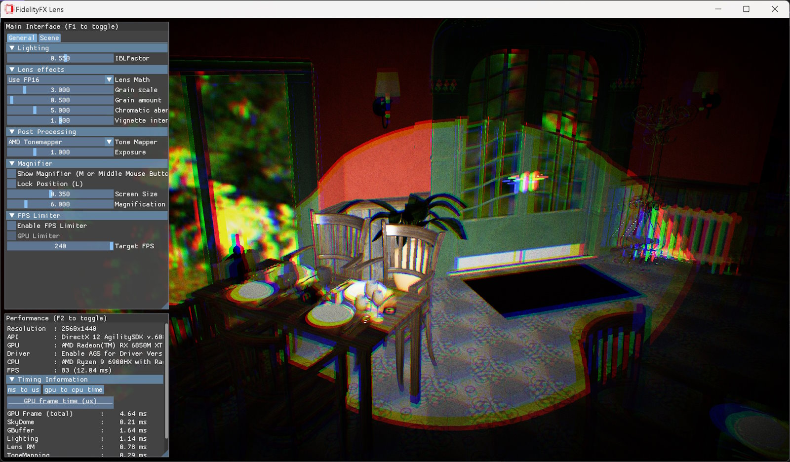

<!-- @page page_samples_lens FidelityFX Lens -->

<h1>FidelityFX Lens</h1>

This sample demonstrates the use of the FidelityFX Lens technique.

For details on the techniques that underpin the FidelityFX Lens effect you can refer to the respective [technique documentation](../techniques/lens.md).

<h2>Requirements</h2>

`Windows` `DirectX(R)12` `Vulkan(R)`

<h2>UI elements</h2>

The sample contains various UI elements to help you explore the techniques it demonstrates. The table below summarizes the UI elements and what they control within the sample.

| Element name | Value | Description |
| -------------|-------|-------------|
| **Lens Math** | `Packed, Non-Packed` | Toggles between packed 16-bit floating point math and non-packed 32-bit floating point math. |
| **Grain scale** | `0.01...20` | Artistic constant. Changes the size/frequency of the film grain noise. |
| **Grain amount** | `0...20` | Artistic constant. Changes how much film grain is added to the image. |
| **Chromatic aberration intensity** | `0...20` | Artistic constant. Changes how much the chromatic aberration effect should be applied. |
| **Vignette intensity** | `0...2` | Artistic constant. Changes how much the vignette effect should be applied. |

<h2>Setting up FidelityFX Lens</h2>

The FidelityFX Lens effect takes as input the color buffer produced by the frame thus far, generally including any geometry rendering, effects, upscalers, etc. - except perhaps UI rendering. 

Almost always, it is preferable for FidelityFX Lens to run as late as possible in the frame to avoid side effects from the color changes introduced by the effect. The FidelityFX Lens effect also uses a small constant buffer, which passes some necessary parameters such as the center coordinate of the screen as well as artistic control values, such as intensity for the film grain, chromatic aberration, and vignette effects. These are all passed from the CPU. The output of the effect is a color buffer of the same resolution as the input. 

<h2>Sample Controls and Configurations</h2>

For sample controls, configuration and Cauldron UI element details, please see [Running the samples](../getting-started/running-samples.md)

<h2>See also</h2>

- [FidelityFX Lens](../techniques/lens.md)
- [FidelityFX Naming guidelines](../getting-started/naming-guidelines.md)