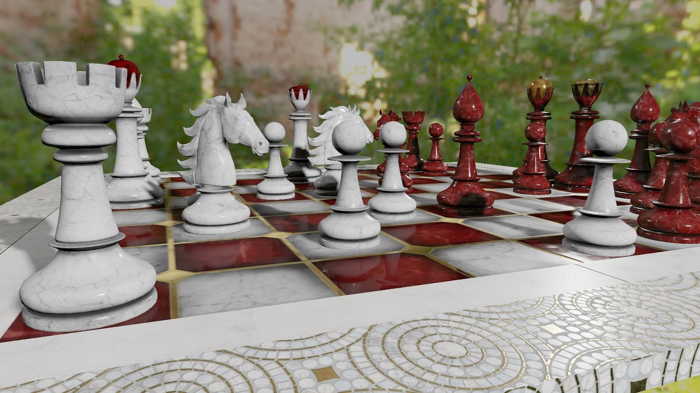

<!-- @page page_samples_stochastic-screen-space-reflections FidelityFX Stochastic Screen-Space Reflections -->

<h1>FidelityFX Stochastic Screen-Space Reflections</h1>

This sample demonstrates the use of both FidelityFX Stochastic Screen-Space Reflections (SSSR) and the FidelityFX Denoiser.

For details on the techniques that underpin [Stochastic Screen-Space Reflections](../techniques/stochastic-screen-space-reflections.md) or [denoising](../techniques/denoiser.md) you can refer to their respective technique documentation.

<h2>Requirements</h2>

`Windows` `DirectX(R)12` `Vulkan(R)`

<h2>UI elements</h2>

The sample contains various UI elements to help you explore the techniques it demonstrates. The table below summarizes the UI elements and what they control within the sample.

| Element name                           | Value       | Description                                                                                                                                       |
| ---------------------------------------|-------------|---------------------------------------------------------------------------------------------------------------------------------------------------|
| **Draw Screen Space Reflections**      | `On/Off`    | Show or hide the reflections when rendering the scene.                                                                                            |
| **Show Reflection Target**             | `On/Off`    | If checked, the render target containing the reflections will be shown on screen.                                                                 |
| **Show Intersection Results**          | `On/Off`    | If checked, the raw reflection data (without denoising applied) will be shown on screen.                                                          |
| **Target frame time in ms**             | `0..?`      | Simulates a slower rendering speed. This allows temporal reprojection to be assessed.                                                             |
| **Max. Traversal Iterations**          | `1..?`      | Caps the maximum number of lookups that are performed from the depth buffer hierarchy. Most rays should terminate after approximately 20 lookups. |
| **Min. Traversal Occupancy**           | `0..32`     | Exit the core loop early if less than this number of threads are running.                                                                         |
| **Most Detailed Level**                | `0..10`     | The most detailed MIP map level in the depth hierarchy. Perfect mirrors always use 0 as the most detailed level.                                  |
| **Depth Buffer Thickness**             | `0..1`      | Bias for accepting hits. Larger values can cause streaks, lower values can cause holes.                                                           |
| **Roughness Threshold**                | `0..1`      | Regions with higher values won't spawn rays.                                                                                                      |
| **Temporal Stability**                 | `0..1`      | Controls the accumulation of history values. Higher values reduce noise, but are more likely to exhibit ghosting artefacts.                        |
| **Temporal Variance Threshold**        | `0..1`      | Luminance differences between history results will trigger an additional ray if they are greater than this threshold value.                       |
| **Enable Variable Guided Tracing**     | `On/Off`    | If checked, a ray will be spawned on pixels where a temporal variance is detected.                                                                 |
| **Samples Per Quad**                   | `1, 2, 4`   | The minimum number of rays per quad. Variance guided tracing can increase this up to a maximum of 4.                                              |

<h2>Setting up FidelityFX Stochastic Screen-Space Reflections</h2>

The sample contains a dedicated [`Render Module`](../../samples/sssr/sssrrendermodule.cpp) for SSSR which creates the context and controls its lifetime. See the quick start guide in the [Stochastic Screen-Space Reflections](../techniques/stochastic-screen-space-reflections.md#quick-start-checklist) technique documentation for more details on how to integrate the SSSR context in your engine.

A final pass called `apply_reflections` is created which takes the output of the SSSR algorithm and composites it on top of the directly lit scene. It's worth noting that the output render target for the SSSR algorithm is automatically created by Cauldron as described in SSSR's render module config file.

<h2>Sample Controls and Configurations</h2>

For sample controls, configuration and Cauldron UI element details, please see [Running the samples](../getting-started/running-samples.md)

<h2>See also</h2>

- [FidelityFX Denoiser](../techniques/denoiser.md)
- [FidelityFX Single Pass Downsampler](../techniques/single-pass-downsampler.md)
- [FidelityFX Stochastic Screen-Space Reflections](../techniques/stochastic-screen-space-reflections.md)
- [FidelityFX Naming guidelines](../getting-started/naming-guidelines.md)
